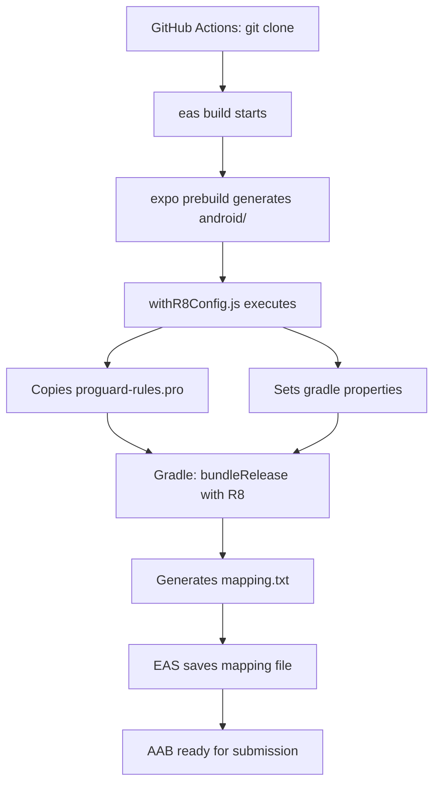

# ProGuard/R8 Configuration for CI/CD

## Overview

This project is configured to use R8 (modern version of ProGuard) for minification and obfuscation in production builds via EAS Build. All settings work in CI/CD without needing to commit the `android/` folder.

## Important: Android Managed Workflow

The `android/` folder is **NOT committed** to git (it's in `.gitignore`) because the project uses Expo managed workflow. All settings are applied through:

1. ✅ **Expo Config Plugin** - `plugins/withR8Config.js` (committed)
2. ✅ **ProGuard Rules** - `proguard-rules.pro` (committed)
3. ✅ **EAS Build Config** - `eas.json` (committed)
4. ✅ **App Config** - `app.config.js` (committed)

## File Structure

```
money-tracker/
├── app.config.js              # Connects R8 config plugin
├── eas.json                   # EAS Build profiles with R8 settings
├── proguard-rules.pro         # ProGuard rules (will be copied to android/app/)
├── plugins/
│   └── withR8Config.js        # Expo Config Plugin for R8 configuration
└── android/                   # ❌ In .gitignore - generated automatically
    └── app/
        └── proguard-rules.pro # Created automatically from root file
```

## Configuration Files

### 1. `plugins/withR8Config.js`

Expo Config Plugin that automatically:
- Sets gradle properties to enable R8
- Copies ProGuard rules from root to `android/app/`
- Executes on every `expo prebuild` (locally and in EAS Build)

```javascript
const { withGradleProperties, withDangerousMod } = require('@expo/config-plugins');

// Sets:
// - android.enableMinifyInReleaseBuilds=true
// - android.enableShrinkResourcesInReleaseBuilds=true
// - android.enablePngCrunchInReleaseBuilds=true
```

### 2. `proguard-rules.pro` (in project root)

ProGuard rules to keep necessary classes:

```proguard
# React Native Core, Hermes, Expo, SQLite
-keep class com.swmansion.reanimated.** { *; }
-keep class com.facebook.hermes.unicode.** { *; }
-keep class expo.modules.** { *; }
-keep class org.sqlite.** { *; }
# ... and other rules
```

### 3. `app.config.js`

Connects config plugin:

```javascript
plugins: [
  'expo-sqlite',
  '@sentry/react-native/expo',
  './plugins/withR8Config.js', // ✅ R8 configuration
],
```

### 4. `eas.json`

Production profile configured for AAB with R8:

```json
{
  "build": {
    "production": {
      "autoIncrement": true,
      "android": {
        "buildType": "app-bundle",
        "gradleCommand": ":app:bundleRelease",
        "config": "release"
      },
      "env": {
        "APP_VARIANT": "production"
      },
      "channel": "production"
    }
  }
}
```

## How It Works in CI/CD (GitHub Actions + EAS Build)

### Build Process



### Steps in Detail

1. **GitHub Actions checkout** - clones repository (without `android/`)
2. **EAS Build starts** - `eas build --platform android --profile production`
3. **Expo prebuild** - generates `android/` folder from app.config.js
4. **Config plugin executes**:
   ```
   ✅ ProGuard rules copied to android/app/proguard-rules.pro
   ✅ Gradle properties set for R8 minification
   ```
5. **Gradle build**:
   ```bash
   ./gradlew :app:bundleRelease
   # R8 minifyEnabled=true
   # shrinkResources=true
   ```
6. **Mapping file generated**:
   ```
   android/app/build/outputs/mapping/release/mapping.txt
   ```
7. **EAS automatically saves mapping file** for Google Play submission

## GitHub Actions Workflow

Existing workflow is already correctly configured:

```yaml
- name: 🚀 Build tag
  if: github.ref_type == 'tag'
  run: |
    PROFILE="${{ github.event.inputs.profile || 'production' }}"
    eas build --platform android --profile $PROFILE --non-interactive --no-wait
```

No additional steps required - EAS Build automatically:
- Applies config plugin
- Enables R8
- Generates mapping file
- Saves mapping file for submission

## Local Testing

### Verify Config Plugin

```bash
# Generate android/ folder with settings
npx expo prebuild --clean

# Verify ProGuard rules were copied
cat android/app/proguard-rules.pro

# Check gradle properties
cat android/gradle.properties | grep -E "(Minify|Shrink)"
```

### Local Build with R8

```bash
cd android
./gradlew :app:bundleRelease

# Mapping file will be here:
ls -lh app/build/outputs/mapping/release/mapping.txt
```

## Crash Deobfuscation

### In Google Play Console

Mapping files are uploaded automatically when using `eas submit`. Crashes will be automatically deobfuscated in Play Console.

### Locally (for debugging)

```bash
# Find retrace utility
RETRACE=$ANDROID_HOME/cmdline-tools/latest/bin/retrace

# Deobfuscate stack trace
$RETRACE mapping.txt stacktrace.txt
```

## Verify Settings

### Check that R8 is Enabled in EAS Build

After build completes in EAS:

1. Download mapping.txt from EAS Dashboard
2. Check AAB size - should be significantly smaller with R8
3. Decompile APK and verify class obfuscation

### App Size

With R8 expected size reduction:
- **APK/AAB**: ~20-30% smaller
- **Installed size**: ~15-25% smaller

## Troubleshooting

### Config Plugin Not Executing

```bash
# Clean and regenerate android/
npx expo prebuild --clean
```

### ProGuard Rules Not Applied

Check that plugin is connected in `app.config.js`:
```javascript
plugins: [
  './plugins/withR8Config.js', // must be in the list
],
```

### Mapping File Not Generated

Check profile in `eas.json`:
```json
"android": {
  "buildType": "app-bundle",  // must be app-bundle or apk
  "gradleCommand": ":app:bundleRelease"  // must be Release
}
```

## Additional Information

- [R8 Documentation](https://developer.android.com/studio/build/shrink-code)
- [EAS Build Configuration](https://docs.expo.dev/build/eas-json/)
- [Expo Config Plugins](https://docs.expo.dev/config-plugins/introduction/)
- [ProGuard Manual](https://www.guardsquare.com/manual/configuration/usage)

