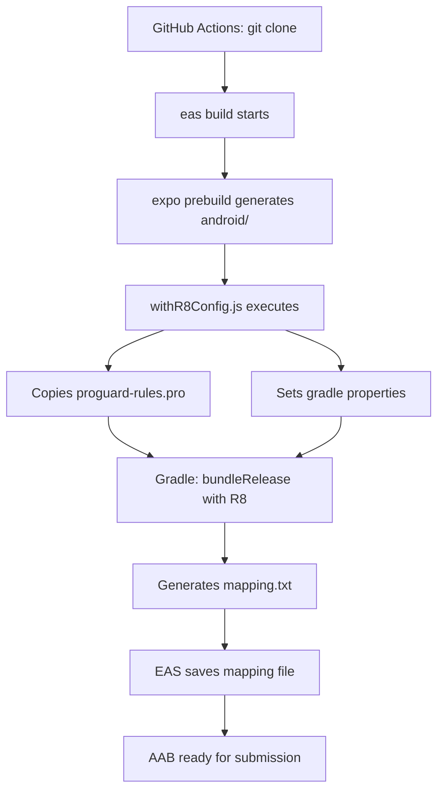

# ProGuard/R8 Configuration for CI/CD

## Overview

This project is configured to use R8 (modern version of ProGuard) for minification and obfuscation in production builds via EAS Build. All settings work in CI/CD without needing to commit the `android/` folder.

## Important: Android Managed Workflow

The `android/` folder is **NOT committed** to git (it's in `.gitignore`) because the project uses Expo managed workflow. All settings are applied through:

1. ✅ **Expo Config Plugin** - `plugins/withR8Config.js` (committed)
2. ✅ **ProGuard Rules** - `proguard-rules.pro` (committed)
3. ✅ **EAS Build Config** - `eas.json` (committed)
4. ✅ **App Config** - `app.config.js` (committed)

## File Structure

```
money-tracker/
├── app.config.js              # Connects R8 config plugin
├── eas.json                   # EAS Build profiles with R8 settings
├── proguard-rules.pro         # ProGuard rules (will be copied to android/app/)
├── plugins/
│   └── withR8Config.js        # Expo Config Plugin for R8 configuration
└── android/                   # ❌ In .gitignore - generated automatically
    └── app/
        └── proguard-rules.pro # Created automatically from root file
```

## Configuration Files

### 1. `plugins/withR8Config.js`

Expo Config Plugin that automatically:
- Sets gradle properties to enable R8
- Configures Gradle JVM memory settings for optimal CI/CD performance
- Copies ProGuard rules from root to `android/app/`
- Executes on every `expo prebuild` (locally and in EAS Build)

```javascript
const { withGradleProperties, withDangerousMod } = require('@expo/config-plugins');

// Sets:
// - android.enableMinifyInReleaseBuilds=true
// - android.enableShrinkResourcesInReleaseBuilds=true
// - android.enablePngCrunchInReleaseBuilds=true
// - org.gradle.jvmargs=-Xmx4096m -XX:MaxMetaspaceSize=1024m (optimized for GitHub Actions)
// - org.gradle.parallel=true
// - org.gradle.configureondemand=true
// - org.gradle.caching=true
// - org.gradle.daemon=true
```

### 2. `proguard-rules.pro` (in project root)

ProGuard rules to keep necessary classes:

```proguard
# React Native Core, Hermes, Expo, SQLite
-keep class com.swmansion.reanimated.** { *; }
-keep class com.facebook.hermes.unicode.** { *; }
-keep class expo.modules.** { *; }
-keep class org.sqlite.** { *; }
# ... and other rules
```

### 3. `app.config.js`

Connects config plugin:

```javascript
plugins: [
  'expo-sqlite',
  '@sentry/react-native/expo',
  './plugins/withR8Config.js', // ✅ R8 configuration
],
```

### 4. `eas.json`

Production profile configured for AAB with R8:

```json
{
  "build": {
    "production": {
      "autoIncrement": true,
      "android": {
        "buildType": "app-bundle",
        "gradleCommand": ":app:bundleRelease",
        "config": "release"
      },
      "env": {
        "APP_VARIANT": "production"
      },
      "channel": "production"
    }
  }
}
```

## How It Works in CI/CD (GitHub Actions + EAS Build)

### Build Process


```mermaid
graph TD
    A[GitHub Actions: git clone] --> B[eas build starts]
    B --> C[expo prebuild generates android/]
    C --> D[withR8Config.js executes]
    D --> E[Copies proguard-rules.pro]
    D --> F[Sets gradle properties]
    E --> G[Gradle: bundleRelease with R8]
    F --> G
    G --> H[Generates mapping.txt]
    H --> I[EAS saves mapping file]
    I --> J[AAB ready for submission]
```

### Steps in Detail

1. **GitHub Actions checkout** - clones repository (without `android/`)
2. **EAS Build starts** - `eas build --platform android --profile production`
3. **Expo prebuild** - generates `android/` folder from app.config.js
4. **Config plugin executes**:
   ```
   ✅ ProGuard rules copied to android/app/proguard-rules.pro
   ✅ Gradle properties set for R8 minification
   ```
5. **Gradle build**:
   ```bash
   ./gradlew :app:bundleRelease
   # R8 minifyEnabled=true
   # shrinkResources=true
   ```
6. **Mapping file generated**:
   ```
   android/app/build/outputs/mapping/release/mapping.txt
   ```
7. **EAS automatically saves mapping file** for Google Play submission

## GitHub Actions Workflow

Existing workflow is already correctly configured:

```yaml
- name: 🚀 Build tag
  if: github.ref_type == 'tag'
  run: |
    PROFILE="${{ github.event.inputs.profile || 'production' }}"
    eas build --platform android --profile $PROFILE --non-interactive --no-wait
```

No additional steps required - EAS Build automatically:
- Applies config plugin
- Enables R8
- Generates mapping file
- Saves mapping file for submission

## Local Testing

### Verify Config Plugin

```bash
# Generate android/ folder with settings
npx expo prebuild --clean

# Verify ProGuard rules were copied
cat android/app/proguard-rules.pro

# Check gradle properties
cat android/gradle.properties | grep -E "(Minify|Shrink)"
```

### Local Build with R8

```bash
cd android
./gradlew :app:bundleRelease

# Mapping file will be here:
ls -lh app/build/outputs/mapping/release/mapping.txt
```

## Crash Deobfuscation

### In Google Play Console

Mapping files are uploaded automatically when using `eas submit`. Crashes will be automatically deobfuscated in Play Console.

### Locally (for debugging)

```bash
# Find retrace utility
RETRACE=$ANDROID_HOME/cmdline-tools/latest/bin/retrace

# Deobfuscate stack trace
$RETRACE mapping.txt stacktrace.txt
```

## Verify Settings

### Check that R8 is Enabled in EAS Build

After build completes in EAS:

1. Download mapping.txt from EAS Dashboard
2. Check AAB size - should be significantly smaller with R8
3. Decompile APK and verify class obfuscation

### App Size

With R8 expected size reduction:
- **APK/AAB**: ~20-30% smaller
- **Installed size**: ~15-25% smaller

## Troubleshooting

### Config Plugin Not Executing

```bash
# Clean and regenerate android/
npx expo prebuild --clean
```

### ProGuard Rules Not Applied

Check that plugin is connected in `app.config.js`:
```javascript
plugins: [
  './plugins/withR8Config.js', // must be in the list
],
```

### Mapping File Not Generated

Check profile in `eas.json`:
```json
"android": {
  "buildType": "app-bundle",  // must be app-bundle or apk
  "gradleCommand": ":app:bundleRelease"  // must be Release
}
```

## Google Play code optimization requirement (February 2027)

From February 2027 Google Play requires any app whose DEX code exceeds **10 MB**
to show at least **25% coverage** across optimization, shrinking *and*
obfuscation. Apps below the threshold are exempt. Failing costs Store visibility
and can restrict publishing, so this is a release blocker, not a nice-to-have.

**Penny is above the threshold and the margin is thin.** Measured on the
`penny-v0.287.0` release APK with `npm run check:dex`:

| | |
|---|---|
| DEX size | 13.79 MB across 2 dex files (threshold: 10 MB) |
| Classes defined | 16,928 |
| Classes obfuscated | 4,667 (**27.6%**, floor: 25%) |

2.6 points of headroom. One more mid-sized dependency pushes the app under.

### Where the un-obfuscated classes are

| Package | Classes | Pinned by |
|---|---|---|
| `com.facebook.react` | 1,837 | `-keep class com.facebook.react.** { *; }` |
| `expo.modules.kotlin` | 1,429 | `-keep class expo.modules.kotlin.** { *; }` |
| `expo.modules.filesystem` | 460 | `-keep class expo.modules.** { *; }` |
| `expo.modules.updates` | 413 | `-keep class expo.modules.** { *; }` |
| `expo.modules.notifications` | 310 | `-keep class expo.modules.** { *; }` |
| `expo.modules.sqlite` | 217 | `-keep class expo.modules.** { *; }` |
| `io.sentry.android` | 545 | Sentry's own consumer rules |
| `androidx.*`, `com.google.android.*` | ~1,300 | those libraries' consumer rules |

Only the first six are ours to narrow. The rest are pinned by consumer rules
that ship inside the dependencies themselves.

### Why `com.facebook.react` is NOT the one to narrow

This was investigated first, on the assumption that the blanket keep was mostly
waste. **It is not.** Removing it breaks minified release builds, and the
evidence is worth recording so the experiment is not repeated:

1. **JNI resolves 88 React Native classes by literal descriptor string**, across
   26 packages (`bridge`, `uimanager`, `fabric`, `runtime`, `turbomodule`,
   `devsupport`, and more). `JNI_OnLoad` in
   `ReactAndroid/src/main/jni/react/jni/OnLoad-common.cpp` calls
   `TransformHelper::registerNatives()`, and `TransformHelper.h` hard-codes
   `"Lcom/facebook/react/uimanager/TransformHelper;"`. That class carries no
   `@DoNotStrip`, and no consumer rule covers `uimanager`. Rename it and the app
   crashes at launch, before any JavaScript runs.

   To re-derive the list after a React Native upgrade:

   ```bash
   grep -rhoE '"L(com/facebook/react|com/facebook/hermes)[^"]*;"' \
     node_modules/react-native/ReactAndroid/src/main/jni \
     node_modules/react-native/ReactCommon | sort -u
   ```

2. **`com.facebook.react.views.*` depends on a name-derived convention.**
   `ViewManagerPropertyUpdater.findGeneratedSetter` does
   `Class.forName("${cls.name}$$PropsSetter")`, deriving the setter's name from
   the ViewManager's *runtime* name. R8 renames the two halves independently, so
   the lookup misses. It does not crash -- the `ClassNotFoundException` is caught
   and every core ViewManager silently falls back to annotation reflection on
   each prop update -- which is arguably worse, being a permanent performance
   regression that no test would notice.

Excluding both hazards leaves 433 genuinely safe classes: **+2.5 points, to
30.1%**. That is a poor trade for a change PR CI cannot verify, and one that any
React Native upgrade can silently re-break by adding a JNI descriptor. The
blanket keep stays.

### Where the headroom actually is

The Expo packages, worth roughly 3,100 classes (~18 points):

- `expo.modules.**` (~1,700). Expo module classes are reached through a
  generated package that references them directly, so the names themselves
  should be free to change. Each module still needs checking for the same two
  hazards as above.
- `expo.modules.kotlin` (1,429), the riskiest. The module DSL leans on Kotlin
  reflection over type parameters. `kotlin.Metadata` and the `Signature`
  attribute are already kept, which is what that reflection reads.

Audit each for hard-coded JNI descriptors and name-derived `Class.forName` calls
*before* touching the rule, using the two checks above. Expo modules are
Kotlin/JNI hybrids, so both hazards are live.

### Measuring

```bash
npm run check:dex -- path/to/penny.apk      # human-readable report
npm run check:dex -- path/to/penny.apk --json
```

`scripts/check-dex-optimization.js` unpacks the APK's `classes*.dex`, walks each
one's `class_defs` table and counts how many defined classes R8 renamed. Exit
codes: `0` above the floor (or requirement not applicable), `1` below it, `2`
could not measure. A CI step can gate on it, and "we could not read the APK"
never masquerades as "we are short".

It reports **obfuscation only**, by its own heuristic. Play derives its figure
from the `r8.json` that AGP 8.10+ emits, across all three axes. Treat this as a
regression guard and an A/B tool between two builds; the App Bundle Explorer in
the Play Console is the source of truth.

### Verifying a narrowing change

PR CI runs lint and unit tests only, neither of which builds a minified APK, and
**neither can catch any of the failure modes above** -- they are all runtime
behaviour of a minified binary. Trigger the **Emulator Screenshots** workflow,
which prebuilds with `APP_VARIANT=production` and runs the app on an emulator,
then walk the app on a real device. Exercise every native-module boundary:
SQLite, notifications, file system, location, Google Sign-In, the heatmap.

### What does not apply to Penny

The same Play announcement carries requirements Penny already clears:

- **Memory (anonymous RSS + swap).** Thresholds start at 2 GB foreground on a
  4 GB device. Penny is nowhere near.
- **Bitmap memory.** Thresholds are 200 MB (background) and 400 MB (cached).
  Penny's only bitmaps are OpenStreetMap tiles in the operations heatmap, orders
  of magnitude below that.
- **Restore Credentials API (April 2027).** Applies to apps with user sign-in.
  Penny has no account of its own; its only sign-in is optional Google
  authentication for the Sheets export, and its data moves between devices
  through backup files. Re-check if an account system is ever added.

Sources: [Play Console technical quality requirements](https://support.google.com/googleplay/android-developer/answer/17492799),
[Elevating app quality (Android Developers Blog)](https://android-developers.googleblog.com/2026/08/app-quality-memory-optimization-secure-onboarding.html).

## Additional Information

- [R8 Documentation](https://developer.android.com/studio/build/shrink-code)
- [EAS Build Configuration](https://docs.expo.dev/build/eas-json/)
- [Expo Config Plugins](https://docs.expo.dev/config-plugins/introduction/)
- [ProGuard Manual](https://www.guardsquare.com/manual/configuration/usage)

